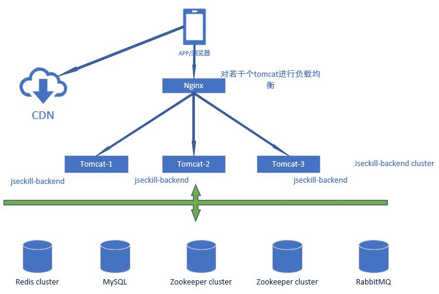
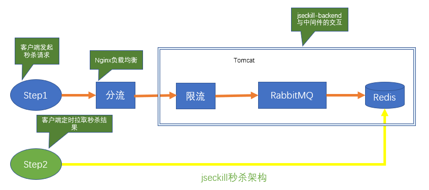

## smilm2sm-shop

### 1.总体架构

系统部署图
<br/><br/><br/><br/>

<br/>
<br/>

秒杀进行的过程如下：
步骤一：触发秒杀。用户通过点击秒杀按钮，后台把对应秒杀信息推送到MQ
步骤二：异步秒杀预减库存。这个步骤用户并发量非常大，抢到后，给与30分钟的时间等待用户付款，如果用户过期未付款，则Redis库存加1
，算用户自动放弃付款。
步骤三：用户付款成功后，后台把付款记录持久化到MySQL中，这个步骤并发量相对小一点，使用数据库的事务解决数据一致性问题

秒杀网站的静态资源，比如静态网页引用的js，css，图片等放到CDN（内容分发网络）上。<br/>
如果小型互联网公司为了减少成本，可以把静态资源部署到nginx下。利用nginx提供静态资源服务的高并发性能<br/>
的特点，可以最大可能的提高静态资源的访问速度。
<br/>
通过nginx反向代理，对外只暴露80端口。同时配置nginx的负载均衡，使用多个tomcat节点<br/>
实现负载均衡。 负载均衡策略按照服务器性能使用权重分配。

### 2.后端暴露秒杀接口
后端暴露接口的作用是：当秒杀时间开始后，才暴露每个商品的md5，只有拿到md5值，才能形成有效的秒杀请求.<br/>
秒杀时间段结束后，此接口不再返回md5值.
<br/>

源码<br/>
```java
public SeckillExposer exposer(long seckill_id) {

	//读取出redis中对应seckill_id的商品数据
	Jedis jedis = jedisPool.getResource();
	String string = jedis.get(RedisKey.SECKILL_ID+seckill_id);
	jedis.close();
	//数据为空，秒杀没准备好或者数据已被删除
	if(StringUtils.isEmpty(string)) return new SeckillExposer(false, seckill_id);

	SeckillGoods seckillGoods = JSON.parseObject(string, SeckillGoods.class);
	long start_time = seckillGoods.getSeckill_start_time().getTime();
	long end_time = seckillGoods.getSeckill_end_time().getTime();
	long now = new Date().getTime();

	//秒杀未开始或者秒杀已结束
	if (start_time > now || end_time < now) {
		return new SeckillExposer(false, seckill_id, start_time, end_time, now);
	}
	//输出对应的md5值
	return new SeckillExposer(true, seckill_id,getMd5(seckill_id));
}
```

### 3.后端秒杀处理

#### 3.1 限流降级
使用Google guava的RateLimiter来进行限流 <br/>
使用AOP切面编程技术封装ExtRateLimiter限流注解，在令牌桶没拿到令牌的请求直接调用降级fallback方法<br/>
RateLimiterAop.java代码 <br/>
```java
	//令牌桶Map，线程安全
	private static ConcurrentHashMap<String,RateLimiter> rateLimiterMap = new ConcurrentHashMap<>();
	/** 切入点*/
	@Pointcut("execution(* com.smile2sm.controller.*.*(..))")
	void pointCat() { }
	
	/** 环绕切入*/
	@Around("pointCat()")
	public Object around(ProceedingJoinPoint jPoint) throws Throwable {
		//获取带有ExtRateLimiter注解的方法
		ExtRateLimiter extRateLimiter = getExtRateLimiter(jPoint);
		//没有注解，直接放行
		if(extRateLimiter == null ) {
			return jPoint.proceed();
		}
		//ExtRateLimiter参数
		double permitsPerSecond = extRateLimiter.permitsPerSecond();
		long timeout = extRateLimiter.timeout();
		ServletRequestAttributes servletRequestAttributes = (ServletRequestAttributes) RequestContextHolder.getRequestAttributes();
		//获取令牌桶
		RateLimiter rateLimiter = getRrateLimiter(servletRequestAttributes, permitsPerSecond);
		//尝试获取令牌
		boolean tryAcquire = rateLimiter.tryAcquire(timeout, TimeUnit.SECONDS);
		//获取不到令牌
		if(!tryAcquire) {
			fallBack(servletRequestAttributes);
			return null;
		}
		return jPoint.proceed();
	}

	/*** 获取不到令牌，直接走服务降级*/
	private void fallBack(ServletRequestAttributes servletRequestAttributes) throws IOException {
		HttpServletResponse response = servletRequestAttributes.getResponse();
		PrintWriter writer = response.getWriter();
		//服务降级提示
		SeckillStateEnum accessLimit = SeckillStateEnum.ACCESS_LIMIT;
		String resultStr = JSON.toJSONString(Result.setResult(accessLimit));
		writer.write(resultStr);
		writer.flush();
		writer.close();
	}
	
	/** 获取对应方法的ExtRateLimiter注解*/
	private ExtRateLimiter getExtRateLimiter(ProceedingJoinPoint jPoint) {
		MethodSignature  methodSignature  = (MethodSignature) jPoint.getSignature();
		Method method = methodSignature.getMethod();
		ExtRateLimiter extRateLimiter = method.getDeclaredAnnotation(ExtRateLimiter.class);
		return extRateLimiter;
	}
	
	/**获取令牌桶,在ConcurrentHashMap中获取不到，则创建一个并存入ConcurrentHashMap中，key为请求的url */
	private RateLimiter getRrateLimiter(ServletRequestAttributes servletRequestAttributes,double permitsPerSecond) {
		//获取请求url
		String requestURI = servletRequestAttributes.getRequest().getRequestURI();
		//根据请求地址获取令牌桶，不存在，则创建一个
		RateLimiter rateLimiter = rateLimiterMap.get(requestURI);
		if(rateLimiter == null) {
			rateLimiter = RateLimiter.create(permitsPerSecond);
			rateLimiterMap.put(requestURI, rateLimiter);
		}		
		return rateLimiter;
	}
```

#### 3.2 Redis执行秒杀

秒杀步骤流程图



1.流程图Step1：先经过Nginx负载均衡和分流

2.Google guava RateLimiter限流。 并发量大的时候，直接舍弃掉大部分用户的请求

3.Redis判断是否秒杀过。避免重复秒杀。如果没有秒杀过 <br/>
把用户名（这里是手机号）和seckillId封装成一条消息发送到RabbitMQ，请求变成被顺序串行处理 <br/>
立即返回状态“排队中”到客户端上，客户端上回显示“排队中...” 
```java
public void handleInRedis(long seckill_id, String phone,String md5) throws SeckillException {
		
		//验证数据是否被篡改
		if((!StringUtils.isEmpty(md5))&& (getMd5(seckill_id)).equals(md5)) {
			throw new SeckillException(SeckillStateEnum.MD5_ERROR);
		}
		
		Jedis jedis = jedisPool.getResource();

		String stockKey = RedisKey.SECKILL_STOCK + seckill_id;
		String boughtKey = RedisKey.SECKILL_USERS + seckill_id;

		String stockStr = jedis.get(stockKey);
		int skillStock = Integer.valueOf(stockStr);
		
		//判断是否重复秒杀
		if (jedis.sismember(boughtKey, phone)) {
			jedis.close();
			logger.info("handleInRedis SECKILL_REPEAT. seckill_id={},phone={}", seckill_id, phone);
			throw new SeckillException(SeckillStateEnum.SECKILL_REPEAT);
		}
		//判断是否还有库存
		if (skillStock <= 0) {
			jedis.close();
			logger.info("handleInRedis SECKILL_OUT. seckill_id={},phone={}", seckill_id, phone);
			throw new SeckillException(SeckillStateEnum.SECKILL_OUT);
		}
		//存在问题：当前库存减一，而添加秒杀成功没有时失败了该怎么处理
		jedis.decr(stockKey);
		jedis.sadd(boughtKey, String.valueOf(phone));
		jedis.close();
		logger.info("handleInRedis SECKILL_SUCCESS. seckill_id={},phone={}", seckill_id, phone);
	}

```
4.后台监听RabbitMQ里消息，每次取一条消息，并解析后，请求Redis做库存减1操作（decr命令） <br/>
并手动ACK队列 
如果减库存成功，则在Redis里记录下库存成功的用户手机号userPhone.

5.流程图Step2：客户端排队成功后，定时请求后台查询是否秒杀成功，后面会去查询Redis是否秒杀成功 <br/>


#### 3.3 付款后实际减库存

1.判断是否秒杀到商品，没秒杀到，异常订单<br/>
2.创建订单，如失败，则可能是重复提交<br/>
3.真正在数据减库存，如失败，则可能是库存已经为0<br/>
源码<br/>
```java
@Transactional
public void updateStock(long seckill_id, String phone) throws SeckillException {
	Jedis jedis = jedisPool.getResource();
	String boughtKey = RedisKey.SECKILL_USERS + seckill_id;
	//判断是否秒杀到
	if (!jedis.sismember(boughtKey, phone)) {
		jedis.close();
		logger.info("updateStock ORDER_ERROR. seckill_id={},phone={}", seckill_id, phone);
		//没秒杀到，异常订单
		throw new SeckillException(SeckillStateEnum.ORDER_ERROR);
	}
	jedis.close();	
	//插入订单
	int result = payOrderDao.insertPayOrder(seckill_id, phone,1, new Date());
	//创建订单失败
	if(result != 1) {
		logger.info("updateStock CREATE_ORDER_ERROR. seckill_id={},phone={}", seckill_id, phone);
		throw new SeckillException(SeckillStateEnum.CREATE_ORDER_ERROR);
	}
	//减库存
	result = seckillGoodsDao.reduceSeckillNum(seckill_id);
	if(result != 1) {
		logger.info("updateStock reduceSeckillNum. seckill_id={},phone={}", seckill_id, phone);
		throw new SeckillException(SeckillStateEnum.CREATE_ORDER_ERROR);
	}

	logger.info("updateStock CREATE_ORDER_SUCCESS. seckill_id={},phone={}", seckill_id, phone);
  }
```
<br/>

